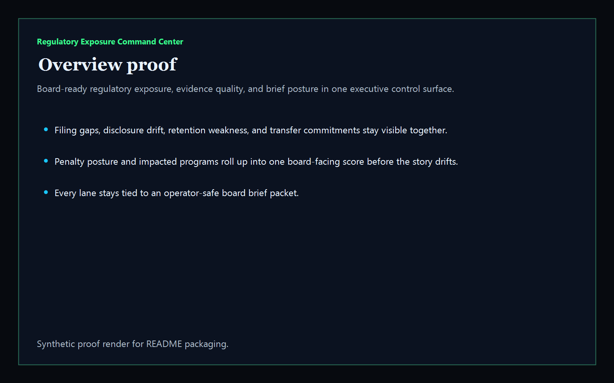
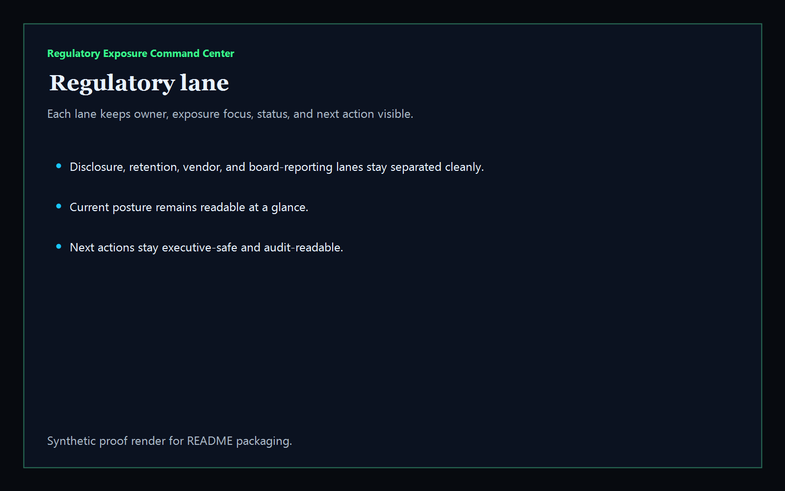
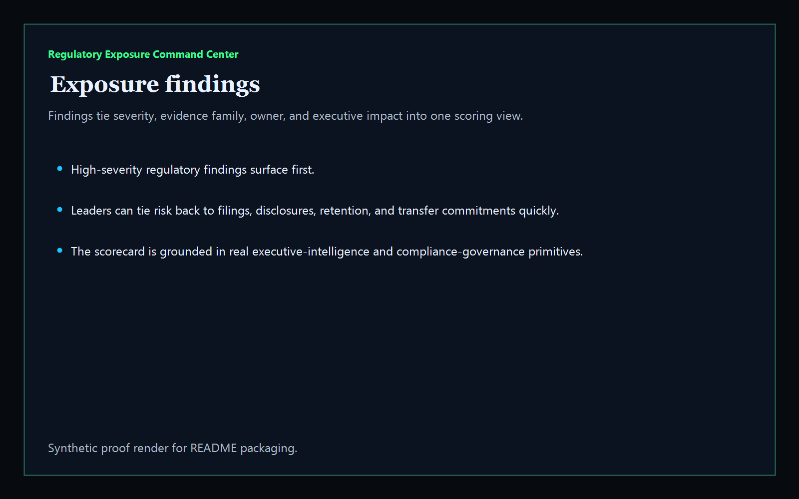
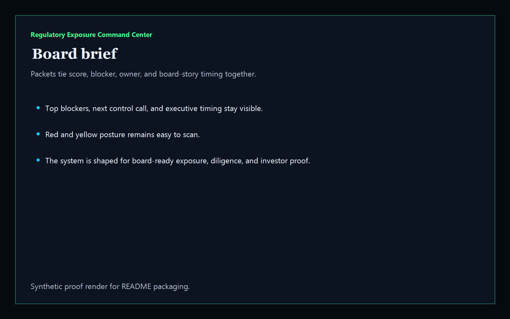

> ## ⚠️ Archived 2026-05-31 — superseded
>
> This repo is archived. The shape it set out to solve was already covered (and shipped) on the apex tool surface:
>
> **→ [https://kineticgain.com/policies/](https://kineticgain.com/policies/)** — /policies/ — 10-vertical readiness spec aggregator (HIPAA/FERPA/ECOA/NAIC/EEOC/CFPB/OMB/ABA/NERC CIP/DFARS)
>
> The apex surface is browser-only, no login, no telemetry, vanilla JS, aligned in vocabulary with NIST AI RMF / EU AI Act / ISO 42001 / SOC 2 / ISO 27018 / GDPR (never "compliant"/"certified" without external attestation).
>
> No migration needed — this repo never had production users; it was Codex-shipped scaffolding that landed in parallel with (and unaware of) the apex executive-tools layer.

---

# Regulatory Exposure Command Center

[](https://github.com/mizcausevic-dev/regulatory-exposure-command-center/actions/workflows/ci.yml)
[](https://github.com/mizcausevic-dev/regulatory-exposure-command-center/actions/workflows/pages.yml)

Board-ready executive intelligence product for regulatory exposure. It turns synthetic review packets into one scorecard covering filing readiness, policy drift, consent and disclosure coverage, retention controls, cross-border commitments, vendor evidence, and board-brief posture.

## What it does

- executive scorecard for regulatory exposure, evidence quality, investment priority, and board story
- regulatory-lane view for disclosures, retention controls, vendor commitments, and board-pack readiness
- exposure-findings view for board-facing findings, owners, and penalty posture
- board-brief packet view for diligence-ready executive summaries
- public synthetic control surface plus JSON APIs and CLI

## Routes

- `/`
- `/regulatory-lane`
- `/exposure-findings`
- `/board-brief`
- `/verification`
- `/docs`

## API

- `/api/dashboard/summary`
- `/api/regulatory-lane`
- `/api/exposure-findings`
- `/api/board-brief`
- `/api/verification`
- `/api/sample`

## Why this matters (KG Embedded tie-back)

This repo is the board-intelligence shape of Kinetic Gain Embedded for regulatory governance and executive diligence. The same primitive can power executive scorecards, operating-partner diligence, control benchmarking, and board briefs without exposing live systems or write paths.

## Screenshots






## CLI

```powershell
npx regulatory-exposure-command-center .\fixtures\regulatory-exposure.json --format markdown
```

## Local run

```powershell
cd regulatory-exposure-command-center
npm install
npm run verify
npm run prerender
npm run render:assets
npm run start
```

Then open:

- [http://127.0.0.1:5544/](http://127.0.0.1:5544/)
- [http://127.0.0.1:5544/regulatory-lane](http://127.0.0.1:5544/regulatory-lane)
- [http://127.0.0.1:5544/exposure-findings](http://127.0.0.1:5544/exposure-findings)
- [http://127.0.0.1:5544/board-brief](http://127.0.0.1:5544/board-brief)

## Live

- [https://regulatory.kineticgain.com/](https://regulatory.kineticgain.com/)

This repo publishes synthetic sample regulatory data only. It does not ship live filing systems, regulator credentials, or authenticated write paths.